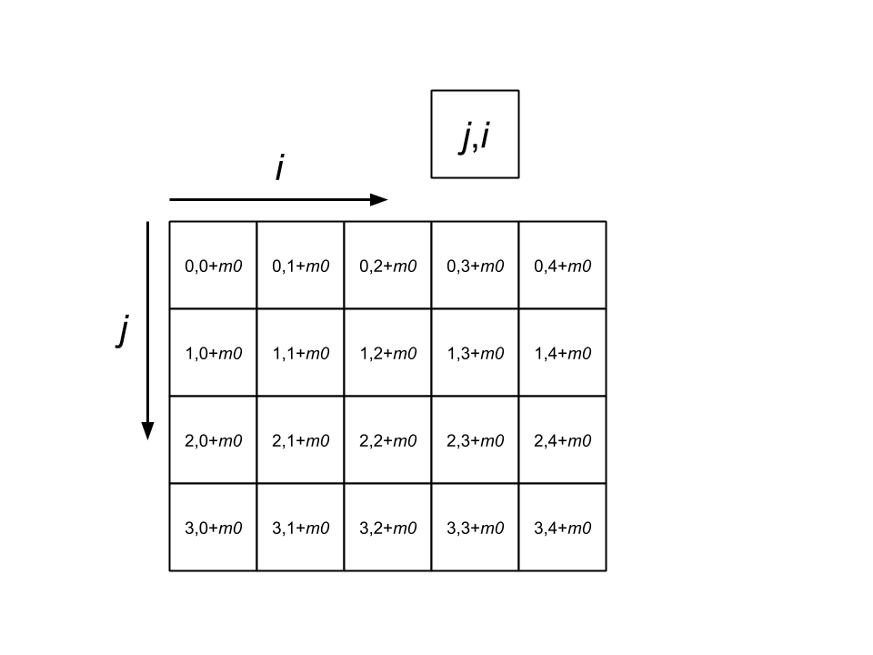

materials
=========

There are a number of material types that have been implemented for use with the RC-FDTD simulation.

The H-field and current arrays have corresponding structures. The variables :math:`A_1`, :math:`A_2`, :math:`\gamma`, and :math:`\beta` are represented using the following two dimensional array

where :math:`m_0` is the starting index of the material. Increments along the vertical axis represent increments in the oscillator index :math:`j`, and increments along the horizontal axis represent increments in space.

.. autoclass:: rcfdtd_sim.sim.Material
   :members:

.. autoclass:: rcfdtd_sim.sim.StaticMaterial
   :members:

.. autoclass:: rcfdtd_sim.sim.NumericMaterial
   :members:

.. autoclass:: rcfdtd_sim.sim.TwoStateMaterial
   :members: