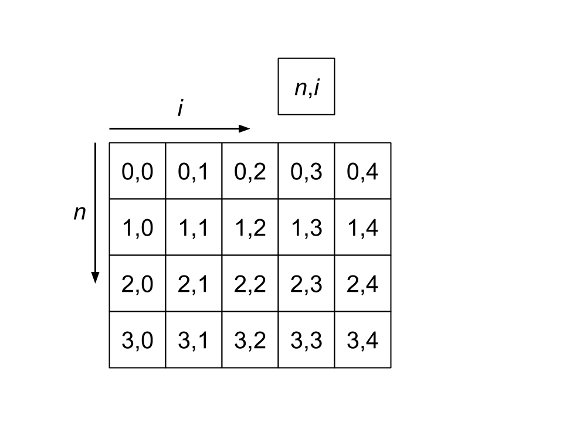

Reference
=========

Simulation
----------

The :code:`Simulation` class treats field indices as follows

.. image:: images/field_structure.png
   :align: center
   :scale: 50

.. autoclass:: rcfdtdpy.sim.Simulation
   :members:

Current
-------

The :code:`Current` class is used to represent currents in the simulation. The :code:`current` argument passed to the
:code:`Current` object at initialization is represented using the following two dimensional array

where :math:`n` represents the time index of the current and :math:`i` represents the spatial index of the current.

.. autoclass:: rcfdtdpy.sim.Current
   :members:

Materials
---------

There are a number of material types that have been implemented for use with the RC-FDTD simulation.

Material
________

The :code:`Material` class is an abstract class containing the properties and functions that any material implementation
should have. Any subclass of material should call to super at initialization and implement each function defined here.

.. autoclass:: rcfdtdpy.sim.Material
   :members:

EmptyMaterial
_____________

The :code:`EmptyMaterial` class represents vacuum

.. autoclass:: rcfdtdpy.sim.EmptyMaterial
   :members:

StaticMaterial
______________

The :code:`StaticMaterial` class is an implementation of the :code:`Material` class. The variables :math:`A_1`, :math:`A_2`,
:math:`\gamma`, and :math:`\beta` are represented using the following two dimensional array

.. image:: images/material_numpy_structure.png
   :align: center
   :scale: 50

where :math:`m_0` is the starting index of the material. Increments along the vertical axis represent increments in the
oscillator index :math:`j`, and increments along the horizontal axis represent increments in space.

The :code:`StaticMaterial` class uses the update equations for :math:`\psi^n` derived in Beard et al..

.. autoclass:: rcfdtdpy.sim.StaticMaterial
   :members:

NumericMaterial
_______________

The :code:`NumericMaterial` class is an implementation of the :code:`Material` class designed to simulate a material
with any arbitrary definition of electric susceptibility :math:`\chi(t)`. The value of :math:`\chi^m` at each simulation
step is calculated at the initialization of the :code:`NumericMaterial`.

.. autoclass:: rcfdtdpy.sim.NumericMaterial
   :members: