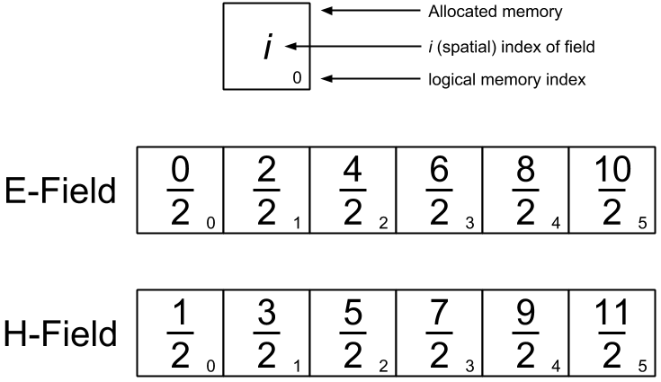

sim
===

sim.Sim
-------
The simulation class treats field indicies as follows

Both the electric and magnetic fields are initialized to the same length, meaning that they have a slight offset in starting and ending locations in the simulation. The field at each time is stored in a Numpy array. The Numpy arrays are stored in a list, which allows each field at previous times to be accessed.

* Discuss the choice of :math:`\frac{\Delta t}{\Delta z}\approx c`
* Discuss how to create a current object

.. autoclass:: sim.Sim
   :members:

sim.Field
---------
The field class can store both current field values as well as past field values as as Numpy array. The E-field array has the following structure

.. image:: ../images/numpy_structure.png
   :align: center
   :scale: 50

The H-field array has a corresponding structure. The user never directly interacts with the entire Numpy array. Rather they set a "current time :math:`n`" which selects a row of the array. Any further operations are performed on that row. The :meth:`sim.Field.export` function simply returns the Numpy field.

.. autoclass:: sim.Field
   :members: